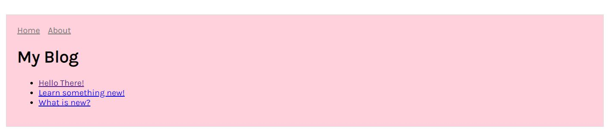

# nextjs-boilerplate
A simple server-rendered Next.JS app by creating multiple dynamic pages. The creation of the dynamic pages are done using query strings.

This project was done by following the step-by-step tutorial provided by [Next.JS by Zeit](https://nextjs.org/learn/basics/create-dynamic-pages).

## Setup Guide
1. Clone repository.
2. Install dependencies by running: `npm install`
3. Run application by running: `npm run dev`

